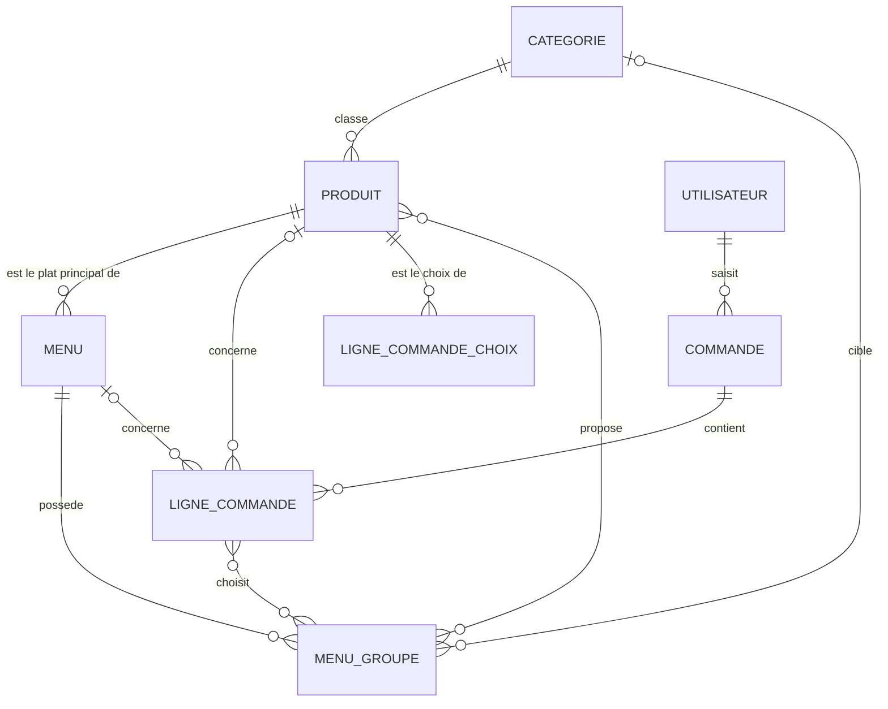

# Modèle de données — APIwacdo

Ce document reprend le modèle conceptuel (MCD) et le modèle logique (MLD) de la base de données du projet, tels qu'ils sont implémentés dans `models/`.

## 1. Modèle Conceptuel de Données (MCD)

### 1.1 Liste des entités et de leurs propriétés

**UTILISATEUR**
- id (identifiant)
- username
- email
- password (haché)
- role (administrateur / preparateur / accueil)

**CATEGORIE**
- id
- nom

**PRODUIT**
- id
- nom
- description
- prix
- image_url
- disponible
- created_at
- updated_at

**MENU**
- id
- nom
- description
- prix
- image_url
- disponible

**MENU_GROUPE** *(un groupe de choix dans un menu : "Boisson", "Accompagnement"...)*
- id
- nom
- obligatoire
- max_choix

**COMMANDE**
- id
- numero
- statut (saisie / preparee / livree)
- mode (comptoir / telephone)
- heure_livraison
- total
- created_at

**LIGNE_COMMANDE** *(une ligne du ticket : un produit seul, ou un menu)*
- id
- quantite
- prix_unitaire *(prix figé au moment de la commande)*

### 1.2 Associations et cardinalités

| Association | Entité 1 | Cardinalité | Entité 2 | Cardinalité | Sens |
|---|---|---|---|---|---|
| CLASSER | CATEGORIE | 0,n | PRODUIT | 0,1 | une catégorie classe des produits ; un produit appartient à 0 ou 1 catégorie |
| COMPOSER | MENU | 1,1 | PRODUIT | 0,n | un menu a exactement un produit principal (ex. le Big Mac) ; un produit peut être le principal de plusieurs menus |
| POSSEDER | MENU | 1,n | MENU_GROUPE | 1,1 | un menu possède un ou plusieurs groupes de choix ; un groupe appartient à un seul menu |
| CIBLER | MENU_GROUPE | 0,n | CATEGORIE | 0,1 | un groupe peut être lié à une catégorie (le groupe propose alors tous les produits disponibles de cette catégorie) |
| PROPOSER | MENU_GROUPE | 0,n | PRODUIT | 0,n | un groupe peut aussi proposer des produits choisis un par un *(association porteuse de l'attribut `supplement`)* |
| SAISIR | UTILISATEUR | 0,n | COMMANDE | 1,1 | un utilisateur saisit plusieurs commandes ; une commande est saisie par un seul utilisateur |
| CONTENIR | COMMANDE | 1,n | LIGNE_COMMANDE | 1,1 | une commande contient une ou plusieurs lignes ; une ligne appartient à une seule commande |
| CONCERNER_PRODUIT | LIGNE_COMMANDE | 0,1 | PRODUIT | 0,n | une ligne concerne éventuellement un produit seul |
| CONCERNER_MENU | LIGNE_COMMANDE | 0,1 | MENU | 0,n | une ligne concerne éventuellement un menu *(exclusif avec CONCERNER_PRODUIT : une ligne a l'un ou l'autre, jamais les deux)* |
| CHOISIR | LIGNE_COMMANDE | 0,n | MENU_GROUPE | 0,n | pour une ligne de type menu, on enregistre le choix fait dans chaque groupe *(association porteuse, résolue par PRODUIT choisi)* |

### 1.3 Schéma (notation Merise, via Mermaid)



---

## 2. Modèle Logique de Données (MLD)

Notation : `TABLE(clé_primaire, attribut, ..., #clé_étrangère)`. Le `#` marque une clé étrangère.

```
UTILISATEUR(id, username, email, password, role)

CATEGORIE(id, nom)

PRODUIT(id, nom, description, prix, image_url, disponible, created_at, updated_at,
        #categorie_id)
    #categorie_id référence CATEGORIE.id (nullable)

MENU(id, nom, description, prix, image_url, disponible,
     #produit_principal_id)
    #produit_principal_id référence PRODUIT.id (non nul)

MENU_GROUPE(id, nom, obligatoire, max_choix,
            #menu_id, #categorie_id)
    #menu_id référence MENU.id (non nul)
    #categorie_id référence CATEGORIE.id (nullable)

MENU_GROUPE_PRODUIT(id, supplement,
                     #groupe_id, #produit_id)
    #groupe_id référence MENU_GROUPE.id (non nul)
    #produit_id référence PRODUIT.id (non nul)
    contrainte d'unicité : (groupe_id, produit_id)

COMMANDE(id, numero, statut, mode, heure_livraison, total, created_at, updated_at,
         #utilisateur_id)
    #utilisateur_id référence UTILISATEUR.id (non nul)
    contrainte d'unicité : numero

LIGNE_COMMANDE(id, quantite, prix_unitaire,
               #commande_id, #produit_id, #menu_id)
    #commande_id référence COMMANDE.id (non nul)
    #produit_id référence PRODUIT.id (nullable)
    #menu_id référence MENU.id (nullable)
    contrainte : (produit_id IS NULL) <> (menu_id IS NULL)  -- l'un ou l'autre, jamais les deux

LIGNE_COMMANDE_CHOIX(id,
                      #ligne_commande_id, #groupe_id, #produit_id)
    #ligne_commande_id référence LIGNE_COMMANDE.id (non nul)
    #groupe_id référence MENU_GROUPE.id (non nul)
    #produit_id référence PRODUIT.id (non nul)
```

### 2.1 Remarques de passage du MCD au MLD

- Les associations **1,1 / 0,n ou 1,n** (CLASSER, COMPOSER, POSSEDER, CIBLER, SAISIR, CONTENIR, CONCERNER_PRODUIT, CONCERNER_MENU) deviennent une simple clé étrangère dans la table du côté « plusieurs ».
- L'association **0,n / 0,n** PROPOSER, qui porte l'attribut `supplement`, devient une **table à part entière** : `MENU_GROUPE_PRODUIT`. C'est elle qui permet de proposer un même produit dans plusieurs groupes, avec un supplément de prix différent selon le groupe.
- L'association **0,n / 0,n** CHOISIR devient elle aussi une table à part, `LIGNE_COMMANDE_CHOIX`, qui relie une ligne de commande, un groupe et le produit réellement choisi par le client dans ce groupe.
- `prix_unitaire` (dans `LIGNE_COMMANDE`) et `supplement` (dans `MENU_GROUPE_PRODUIT`) sont stockés en `NUMERIC(8,2)`, jamais en nombre à virgule flottante, pour éviter les erreurs d'arrondi sur des montants d'argent.

---

## 3. Schéma physique (tel qu'implémenté)

Le schéma ci-dessus correspond exactement aux 9 tables créées par la migration Alembic initiale (`alembic/versions/c1bd65457d10_creation_initiale_des_tables.py`) :
`utilisateurs`, `categories`, `produits`, `menus`, `menu_groupes`, `menu_groupe_produits`, `commandes`, `lignes_commande`, `lignes_commande_choix`.
