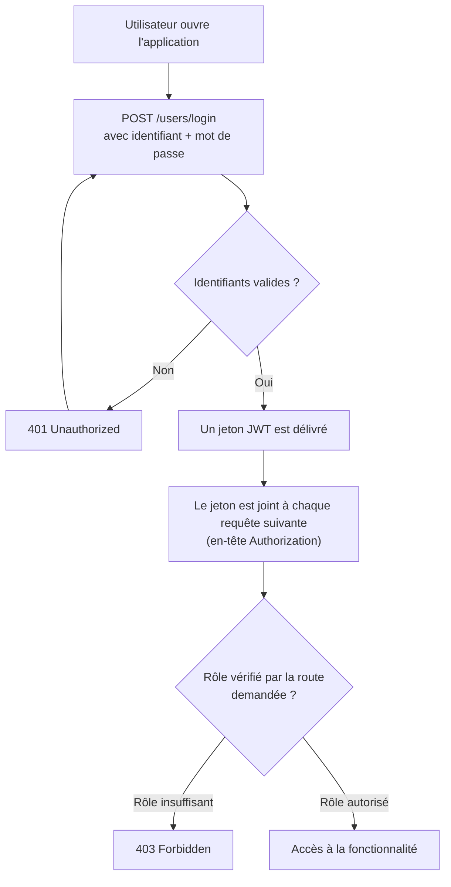
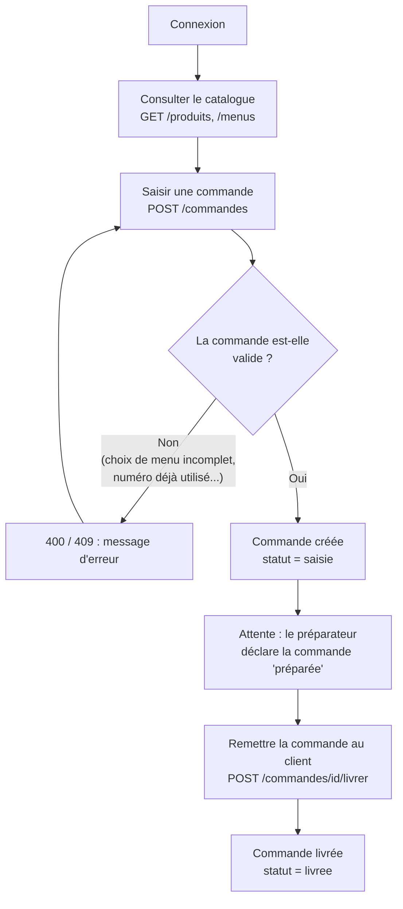
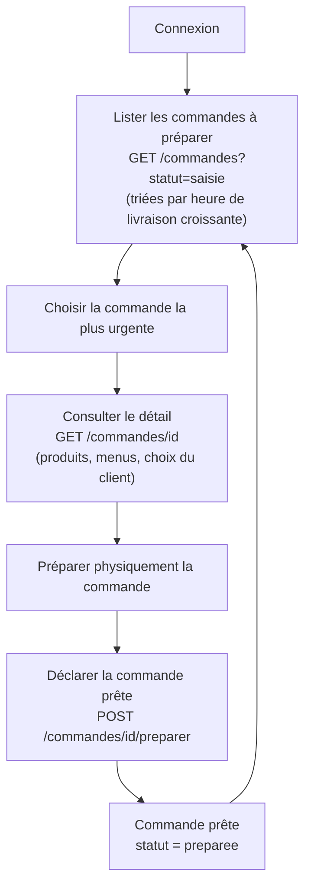
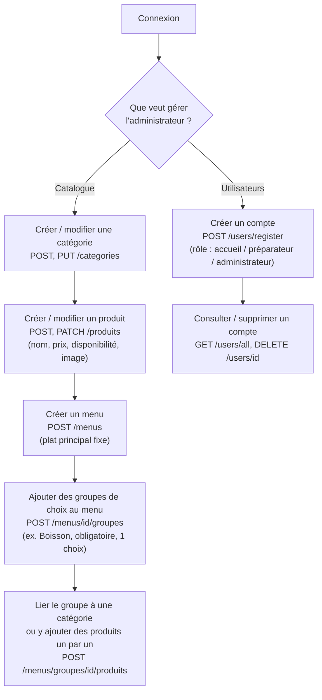
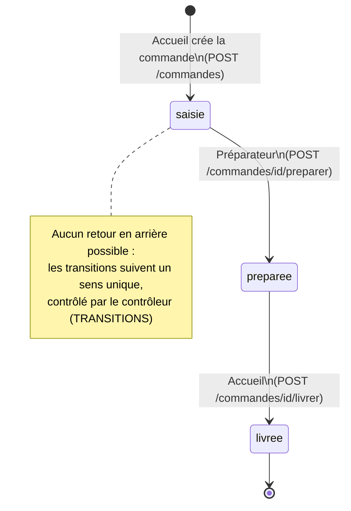

# Schémas fonctionnels — APIwacdo

Ces schémas décrivent l'enchaînement des actions possibles pour chaque rôle, en fonction des droits définis dans l'application (`require_role`).

## 1. Authentification (commune aux 3 rôles)



## 2. Parcours du compte Accueil

L'accueil saisit les commandes (au comptoir ou par téléphone) et les remet aux clients.



## 3. Parcours du compte Préparation de commandes

Le préparateur voit les commandes à préparer, triées par heure de livraison, et les déclare prêtes.



## 4. Parcours du compte Administration

L'administrateur gère le catalogue et les comptes utilisateurs.



## 5. Cycle de vie d'une commande (vue d'ensemble)

C'est le schéma central de l'application : il résume les statuts possibles d'une commande et qui a le droit de faire passer la commande d'un statut à l'autre.



## 6. Vérification des choix d'un menu (logique interne)

Ce schéma détaille ce qui se passe à l'intérieur de `POST /commandes` quand une ligne concerne un menu, puisque c'est la partie la plus complexe du projet.

```mermaid
flowchart TD
    A[Ligne de commande = un menu] --> B{Pour chaque groupe\ndu menu}
    B --> C{Le client a-t-il fait\nun choix dans ce groupe ?}
    C -- "Non, et le groupe\nest obligatoire" --> D[400 : choix obligatoire manquant]
    C -- Oui --> E{Le produit choisi\nfait-il partie des\nproduits proposés\npar ce groupe ?}
    E -- Non --> F[400 : produit non proposé\nou non disponible]
    E -- Oui --> G{Le nombre de choix\ndépasse-t-il max_choix ?}
    G -- Oui --> H[400 : trop de choix]
    G -- Non --> I[Choix accepté]
    I --> J{Le groupe est-il\nrempli à la main\n(pas lié à une catégorie) ?}
    J -- Oui --> K[Ajouter le supplément\ndu produit choisi au prix]
    J -- Non --> L[Pas de supplément\n-- produit pris dans la catégorie]
    K --> M[Ligne suivante / fin]
    L --> M
```
